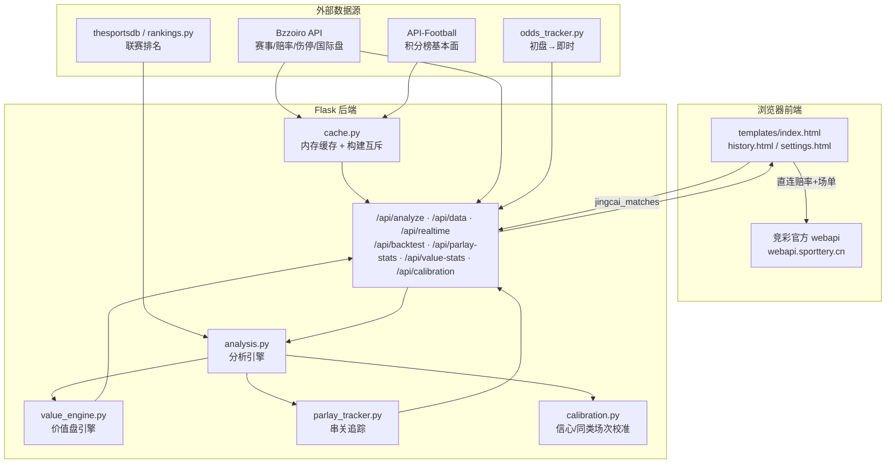
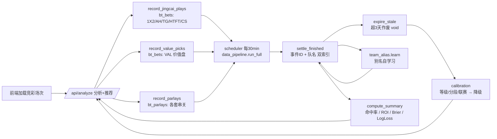

# 竞彩足球智能分析（jingcai-analyzer）

Flask + 前端直连竞彩官方 API 的足球赛事分析 / 价值盘 / 回测闭环系统。
> 免责声明：仅供数据分析与个人学习参考，不构成投注建议，请理性购彩。

---

## 一、系统架构



### 模块职责

| 模块 | 职责 |
|---|---|
| `app.py` | 路由与编排；竞彩/Bzzoiro 数据路径；分析结果 + 推荐 + 价值盘返回 |
| `analysis.py` | 分析引擎：赔率概率核心 + 基本面交叉 + 让球/总进球/半全场 + 串关方案 |
| `value_engine.py` | 价值盘：国际锐盘去水基准 + Dixon-Coles 对数几率校准 + 分数凯利 |
| `parlay_tracker.py` | 串关级独立追踪：记录 / 逐腿结算 / 命中率与 ROI |
| `calibration.py` | 信心等级 + 同类场次（玩法\|赔率区间 / 联赛）校准，保守降级 |
| `team_alias.py` | 队名别名学习（英文→中文），提升队名兜底结算率 |
| `backtest.py` | 回测业务：记录投注、按玩法结算、汇总命中率/ROI/Brier/LogLoss |
| `backtest_models.py` | `bt_*` 表模型（赔率快照 / 预测 / 投注 / 串关 / 汇总） |
| `data_pipeline.py` | 结算流水线：`run_full` = `settle_finished` + `expire_stale` |
| `scheduler.py` | 定时任务：每日历史结算、每 30 分钟回测流水线 |
| `cache.py` | Bzzoiro 结果内存缓存，避免冷启动卡顿 |
| `bizzoiro_client.py` | Bzzoiro 客户端：赛事/赔率/伤病/国际盘/预测/已完赛 |
| `odds_tracker.py` | 「初盘→即时」赔率变动追踪 |
| `jingcai_scraper.py` | 竞彩官方抓取（服务器端常 403，主要供前端参考） |

> 关键约束：服务器端直连 `sporttery.cn` 会 403，竞彩数据由**浏览器前端直连**提供；
> 后端 `cache` 只走 Bzzoiro。
>
> **前台只展示竞彩官方开售场次**：竞彩直连取不到时显示空状态（提示"暂无竞彩官方场次"），
> 不回退到 Bzzoiro / 模拟场次；第三方数据仅用于后台伤停/排名/国际盘富化，不进入前台展示与回测。

---

## 二、推荐方向如何产生

1. **核心=赔率概率**：`predicted_option` 默认取市场最低赔方，信心初值=隐含概率 `1/赔率`。
2. **基本面交叉校验**（`_fundamental_pick`）：排名/积分/状态/xG/伤病独立倾向；
   与市场一致→提信心；强信号相悖→改判；否则降信心。
3. **价值覆盖**：推荐方向竞彩赔率相对国际锐盘 `edge ≤ -3%` → 标 `overpriced`，**串关排除**。
4. **同类场次校准**：等级/赔率区间/联赛历史不盈利 → **降级**（只降不升）。
5. **价值盘**（独立输出）：以锐盘去水概率为基准，Dixon-Coles 对数几率校准
   （权重 0.9→0.6 随样本自适应），`edge ≥ 2%` 才推荐，分数凯利定注。

---

## 三、回测闭环



**要点**

- 回测**只统计竞彩官方开售场次**（`bt_bets.jingcai=True`），体彩不开的 Bzzoiro 场次不记录。
- **去重**：同一场同玩法只记一条。
- **口径对齐**：1X2 记录的是页面实际推荐的 `predicted_option`（可能被基本面改判），
  而非"最低赔方"，确保验证的是真实推荐。
- **玩法**：1X2 / 让球 `AH` / 总进球 `TG` / 半全场 `HTFT` 用官方真实赔率；
  模型推算的标 `estimated=True`（不计 ROI，只计命中率）。
- **结算覆盖**：近 7 天已完赛事件 + 数字事件 ID 并发补查，ID 优先、队名兜底；
  竞彩编号场次靠队名匹配闭环。
- **超期作废**：超 3 天仍无赛果 → `void`，保持统计干净。

---

## 四、接口一览

| 接口 | 说明 |
|---|---|
| `POST /api/analyze` | 主分析接口（竞彩场次 / Bzzoiro 事件），返回分析+推荐+价值盘 |
| `GET /api/data` | 缓存数据分析结果 |
| `GET /api/realtime` | 按 `source` 切换数据源的实时分析 |
| `GET /api/history` · `POST /api/save-history` | 历史预测/投注记录 |
| `GET /api/backtest` · `POST /api/backtest/run` | 回测汇总 / 手动触发结算 |
| `GET /api/parlay-stats` | 串关级命中率与 ROI |
| `GET /api/value-stats` | 价值盘 ROI + Brier/LogLoss + 权重 |
| `GET /api/calibration` | 信心/分段/联赛校准表 |
| `GET /health` · `GET /robots.txt` | 健康检查 / 爬虫声明 |

---

## 五、部署（PythonAnywhere）

```bash
cd ~/jingcai-analyzer && git -c http.proxy= -c https.proxy= pull
python tools/selfcheck.py      # 必须 RESULT: ALL OK
python tools/test_logic.py     # 改动分析/结算逻辑时必跑
```

通过后 → 页面 **Web → Reload** → 浏览器 **Ctrl+F5**。

**环境变量**：`SECRET_KEY`、`BZZOIRO_API_KEY`、`API_FOOTBALL_KEY`、`DATABASE_URL`（可选）、
`DIAG_ENABLED`（=1 才开放 `/api/db-check`）。

---

## 六、推送前自检 / 约定

见 [`AGENTS.md`](AGENTS.md)：改动后必跑 `tools/selfcheck.py`（语法/损坏字符/前端括号配平），
改动分析或结算逻辑另跑 `tools/test_logic.py`。
